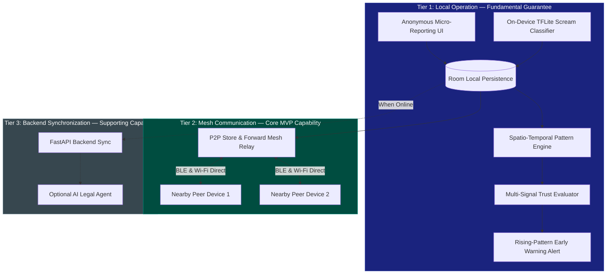

# SheGuard 🛡️ — Offline-First Mesh & AI Safety System

> **Team Aegis** | Problem Statement **CX1001** (`teamAegis_CX1001_codex2026`)
> *Turning individual safety signals into verified, community-wide early warnings — zero internet required.*

[](LICENSE)
[](https://developer.android.com)
[](https://kotlinlang.org)
[](architecture.yaml)

---

## 🌟 Pitch & Vision

In sudden danger, a victim cannot open a complex app, navigate menus, or count on stable 5G connectivity. Traditional safety apps are reactive SOS buttons that fail precisely when needed most: in signal dead zones, jammed crowds, or remote areas.

**SheGuard** reimagines personal safety from the ground up. It is an **offline-first, intelligence-driven safety companion** that transforms low-friction, anonymous micro-reports and real-time acoustic sensors into verified, community-wide early warning alerts.

By combining on-device ML, peer-to-peer mesh routing, multi-signal trust scoring, and cryptographic evidence sealing, SheGuard detects emerging threat patterns *before* incidents escalate—**operating 100% locally on-device**.

---

## 🚀 Key Innovation Highlights

| Feature | The SheGuard Advantage |
|---|---|
| 📶 **Zero-Internet Operation** | Operates via a strict **3-Tier Offline-First Hierarchy**: Local Execution → P2P Mesh Relay → Async Cloud Sync. |
| 🎙️ **On-Device TFLite Scream Detection** | Runs quantized **YAMNet neural networks** locally at 16kHz to identify acoustic screams and yells in milliseconds without streaming raw audio anywhere. |
| 🕸️ **Peer-to-Peer Mesh Network** | Relays anonymous safety packets hop-by-hop across nearby devices using **BLE & Wi-Fi Direct** via Google Nearby Connections. |
| 🛡️ **Anti-Gaming & Trust Engine** | Prevents false alarms and malicious spam using multi-signal evaluation (reporter diversity, temporal independence, spatial consistency). |
| 🌳 **Merkle Tree Evidence Sealing** | Cryptographically seals audio, location logs, and sensor streams on-device with SHA-256 Merkle trees signed by Android Keystore for tamper-proof auditing. |
| 🗺️ **Dynamic Safety Routing (DSR)** | Recommends safe paths and warns users entering active spatio-temporal danger clusters. |

---

## 🧠 Deep-Dive: Core Technologies Explained Simply

### 1. 🎙️ TFLite Acoustic Scream Detector
* **What is it?**
  TensorFlow Lite (TFLite) is Google's lightweight framework for running machine learning models directly on mobile edge devices.
* **How SheGuard uses it:**
  SheGuard embeds a custom-tuned **YAMNet model** (a deep convolutional neural network trained on AudioSet classes). The app continuously samples audio in rolling 0.975s frames at 16kHz.
* **Why it matters for safety:**
  When a distress scream or high-pitch yell occurs, TFLite detects it in **real-time on-device** (evaluating AudioSet indices for *Scream, Yell, Shout, Screaming*).
* **Privacy Guarantee:**
  Raw audio **never leaves the device** and is never uploaded or sent to an LLM. Inference runs entirely offline inside mobile memory.

---

### 2. 🌳 Cryptographic Evidence Sealing & Merkle Roots
* **What is a Merkle Root?**
  A **Merkle Tree** is a cryptographic data structure where every "leaf" is a hash of a data block (e.g., a 5-second audio chunk or location coordinate), and every parent node is a cryptographic hash of its children. The single hash at the very top is the **Merkle Root**.
* **How SheGuard uses it:**
  During active distress, SheGuard captures continuous evidence (audio streams, GPS logs, motion telemetry). Each chunk is encrypted with hardware-backed **AES-256-GCM** keys from the Android Keystore and hashed using **SHA-256**. The hashes are organized into a binary Merkle tree.
* **Why it matters for judges & legal auditability:**
  If even a *single byte* of evidence is tampered with, deleted, or altered post-incident, recalculating the Merkle tree will yield a completely different Merkle Root. By signing the final Merkle Root with the device's hardware key, SheGuard provides **tamper-evident legal evidence packages** without relying on a central database.

---

### 3. 🗺️ Dynamic Safety Routing (DSR) & Spatio-Temporal Heatmaps
* **What is Dynamic Safety Routing (DSR)?**
  Unlike standard maps (Google Maps/Apple Maps) that optimize strictly for shortest travel time, **DSR** calculates optimal navigation paths based on real-time **spatial risk heatmaps**.
* **How SheGuard uses it:**
  The on-device **Spatio-Temporal Pattern Engine** clusters anonymous micro-reports using Haversine spatial distance (e.g., 200m radius) and sliding temporal windows (e.g., 30–120 minutes). Active risk clusters are factored into navigation scoring to steer users away from unlit streets, active harassment zones, or crowded suspicious gatherings.

---

### 4. 🕸️ BLE & Wi-Fi Direct Peer-to-Peer Mesh Relay
* **What is it?**
  A mesh network allows mobile devices to talk directly to each other over Bluetooth Low Energy (BLE) and Wi-Fi Direct without cell towers, Wi-Fi routers, or internet access.
* **How SheGuard uses it:**
  Powered by Google Nearby Connections, SheGuard devices broadcast compact, privacy-minimized safety packets hop-by-hop (up to 12 hops) with store-and-forward queueing and cryptographic packet deduplication.
* **Why it matters:**
  In signal blackouts, underground transit, or crowded protests, micro-reports and early warnings spread organically across nearby devices in the mesh network.

---

### 5. 🛡️ Multi-Signal Trust & Anti-Gaming Layer
* **The Problem:** How do you prevent bad actors or trolls from spamming fake reports to create false panic?
* **The Solution:** SheGuard enforces a strict architectural invariant: **Raw report volume alone NEVER triggers an alert.**
* **Trust Evaluation Signals:**
  1. **Reporter Diversity:** Requires independent anonymous tokens across multiple physical devices.
  2. **Temporal Independence:** Spreads validation over time windows to block rapid bot/script flooding.
  3. **Spatial Consistency:** Validates that reports originate within coherent physical proximity.

---

## 🏗️ Architectural Hierarchy (Offline-First)

SheGuard operates on a strict **3-Tier Offline-First Hierarchy**:



---

## 🔁 End-to-End Data & Signal Flow

```mermaid
sequenceDiagram
    autonumber
    participant U as User / Sensors
    participant App as Android Device (Local)
    participant Engine as Spatio-Temporal Engine
    participant Trust as Anti-Gaming Trust Evaluator
    participant Mesh as P2P Mesh Network
    participant Peer as Nearby Peer Device

    rect rgb(20, 30, 50)
        Note over U,App: Step 1: Signal Capture (Offline)
        U->>App: Low-Friction Micro-Report OR Acoustic Scream (TFLite)
        App->>App: Save Locally to Room Database & AES-256 Encrypt Evidence
    end

    rect rgb(20, 50, 40)
        Note over App,Trust: Step 2: Local Processing & Clustering
        App->>Engine: Queue Micro-Report for Clustering
        Engine->>Engine: Spatial (Haversine) & Temporal Clustering
        Engine->>Trust: Evaluate Candidate Pattern
        Trust->>Trust: Check Reporter Diversity & Spam Filtering
    end

    rect rgb(50, 20, 40)
        Note over Trust,Peer: Step 3: Actionable Alert & Peer Relay
        alt Trust Score > Threshold
            Trust->>App: Surface Early Warning Alert (Vibration + HUD)
        end
        App->>Mesh: Queue Compact Mesh Packet
        Mesh->>Peer: Relay Hop-by-Hop via BLE / Wi-Fi Direct
    end
```



---

## 🛠️ Tech Stack & Architecture

### Android Client (`/android`)
* **Language:** Kotlin 1.9+
* **UI Framework:** Jetpack Compose with Material 3 & Custom Safety UX Design System
* **Architecture:** Clean Architecture + MVVM + Feature Modules
* **Database:** Room (SQLite) with explicit migration paths
* **ML / On-Device AI:** TensorFlow Lite (`yamnet.tflite` model) with hybrid DSP audio processing
* **Mesh Network:** Google Nearby Connections API (BLE + Wi-Fi Direct)
* **Security & Cryptography:** Android Keystore, AES-256-GCM file storage, SHA-256 Merkle Trees, ECDSA Signatures

### Backend Service (`/backend`)
* **Language / Framework:** Python 3.11+ / FastAPI
* **Data Validation:** Pydantic v2
* **Storage / Sync:** PostgreSQL / SQLite
* **AI Provider Strategy:** Groq / Local LLM provider abstraction for optional draft legal assistance

---

## 📂 Repository Structure

```
.
├── android/                        # Native Android Application (Kotlin)
│   ├── app/                        # App Entry point, Jetpack Compose UI Screens
│   ├── core/
│   │   ├── domain/                 # Models, Repositories, SpatioTemporalPatternEngine
│   │   ├── data/                   # Room Database, DAOs, Entity Mappings
│   │   └── security/               # Android Keystore, AES-256-GCM, MerkleTree
│   ├── services/
│   │   ├── detection/              # TFLiteScreamClassifier, KeywordDetector, MotionDetector
│   │   └── mesh/                   # Google Nearby Connections P2P Mesh Relay
│   └── features/
│       ├── incident/               # Incident State Machine & Foreground Safety Service
│       └── panic/                  # Hardware & UI Panic Controller
├── backend/                        # FastAPI Backend Service
│   ├── app/                        # API Router, Core Config, Models
│   └── tests/                      # Pytest integration suite
├── docs/                           # Documentation
│   ├── SHEGUARD_PRD.md             # Canonical Product Requirements Document
│   ├── specs/                      # Technical specifications (AI, Trust, Mesh, Alert)
│   └── adr/                        # Architecture Decision Records (ADRs 0001-0009)
└── architecture.yaml               # Root Architectural Contract & Invariants
```

---

## ⚡ Quick Start & Verification

### Prerequisites
* **Android Studio:** Hedgehog (2023.1.1) or newer
* **Android SDK:** API Level 34 (Android 14)
* **JDK:** Java 17

### Building & Running Unit Tests

```bash
# Clone the repository
git clone https://github.com/your-org/sheguard.git
cd sheguard

# Execute all Android unit tests from root
./gradlew test

# Build debug APK
./gradlew :android:app:assembleDebug
```

---

## 🏆 Hackathon Demo Acceptance Criteria

SheGuard satisfies all 6 mandatory MVP demo criteria defined in `docs/SHEGUARD_PRD.md`:

1. ✅ **Anonymous Micro-Reporting:** Users submit quick incident/hazard reports completely offline.
2. ✅ **Local Persistence & Queuing:** Micro-reports are stored locally in Room storage without network failures.
3. ✅ **BLE / Wi-Fi Direct Mesh Relay:** Reports relay peer-to-peer between disconnected nearby Android devices.
4. ✅ **Spatio-Temporal Pattern Detection:** Multiple reports cluster automatically into emerging spatial risk patterns.
5. ✅ **Trust & Anti-Gaming Verification:** Spam/duplicate reports from single sources are filtered out; diverse reports escalate trust confidence.
6. ✅ **Actionable Early Warning Alert:** High-confidence rising patterns display clear spatial, temporal, and risk context warnings.

---

## 🛡️ Privacy & Security Policy

SheGuard is built with privacy and security as foundational engineering requirements:

* **Zero Location Tracking:** SheGuard does NOT record or maintain continuous background GPS tracking histories. Location coordinates are attached strictly to micro-reports or active panic activations.
* **On-Device Audio Isolation:** Audio processed by the TFLite Acoustic Scream Classifier is evaluated in rolling volatile memory (RAM) frames. Raw audio is never saved to persistent storage unless an active distress incident is explicitly triggered.
* **Cryptographic Hardware Isolation:** Encryption keys are generated inside the Android Keystore Trusted Execution Environment (TEE) / StrongBox and never leave the hardware module.
* **Anonymous Tokens:** User identities are decoupled from safety reports via cryptographically rotated pseudo-random reporter tokens.

---

## 🤝 Contributing

We welcome contributions from the open-source community to advance personal safety technology!

1. **Fork the Repository** and create a feature branch (`git checkout -b feature/amazing-feature`).
2. **Adhere to standard Kotlin & Clean Architecture guidelines** enforced in `architecture.yaml`.
3. **Ensure Unit Tests Pass:** Run `./gradlew test` before opening a pull request.
4. **Commit Your Changes:** Follow conventional commit messages (`feat:`, `fix:`, `docs:`).
5. **Open a Pull Request:** Describe the problem solved and link relevant issues.

---

## 📜 License & Legal Disclaimers

### Open Source License
SheGuard is released under the **MIT License**.

```text
Copyright (c) 2026 Team Aegis (Problem Statement CX1001)

Permission is hereby granted, free of charge, to any person obtaining a copy
of this software and associated documentation files (the "Software"), to deal
in the Software without restriction, including without limitation the rights
to use, copy, modify, merge, publish, distribute, sublicense, and/or sell
copies of the Software, and to permit persons to whom the Software is
furnished to do so, subject to the following conditions:

The above copyright notice and this permission notice shall be included in all
copies or substantial portions of the Software.

THE SOFTWARE IS PROVIDED "AS IS", WITHOUT WARRANTY OF ANY KIND, EXPRESS OR
IMPLIED, INCLUDING BUT NOT LIMITED TO WARRANTIES OF MERCHANTABILITY,
FITNESS FOR A PARTICULAR PURPOSE AND NONINFRINGEMENT. IN NO EVENT SHALL THE
AUTHORS OR COPYRIGHT HOLDERS BE LIABLE FOR ANY CLAIM, DAMAGES OR OTHER
LIABILITY, WHETHER IN AN ACTION OF CONTRACT, TORT OR OTHERWISE, ARISING FROM,
OUT OF OR IN CONNECTION WITH THE SOFTWARE OR THE USE OR OTHER DEALINGS IN THE
SOFTWARE.
```

### Safety & Legal Disclaimers

1. **Early Warning Community Signals:** SheGuard pattern alerts are community-driven early warning risk signals generated algorithmically from anonymous local reports and nearby mesh peers. SheGuard **does not guarantee emergency service, police dispatch, or physical protection**. In immediate danger, users should always contact local emergency services (e.g., 112 / 911) directly if reachable.
2. **Cryptographic Evidence Auditability:** The SHA-256 Merkle root and Keystore ECDSA signature included in exported evidence packages verify technical integrity (confirming data has not been modified since sealing). Technical verification **does not guarantee court admissibility or law enforcement acceptance**. Users should consult legal counsel regarding formal evidentiary submissions.

---

## ✉️ Team Aegis & Contact

* **Team Name:** Aegis
* **Problem Statement:** CX1001 (`teamAegis_CX1001_codex2026`)
* **Target Identity:** SheGuard — Preventive & Community Safety
